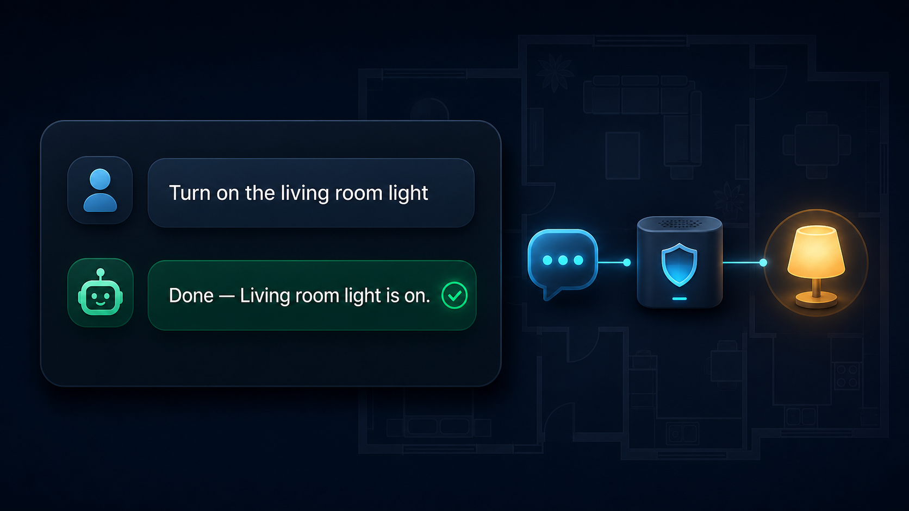
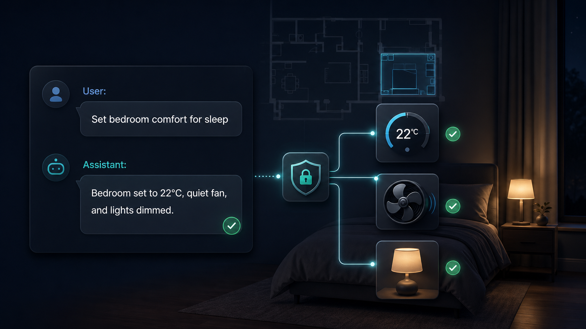
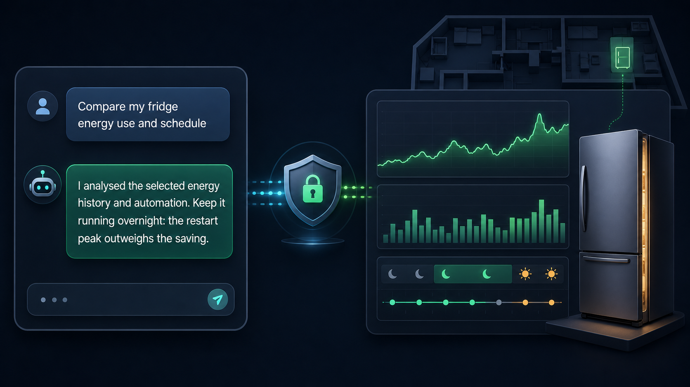

# HA ChatGPT Gateway

Self-hosted Docker gateway that lets a personal ChatGPT GPT Action securely access and control a Home Assistant instance through a small, policy-enforced REST API.

The gateway is designed to run on a NAS, mini PC, Raspberry Pi, VPS, or any Docker host. It does **not** use the OpenAI API and does **not** require an OpenAI API key.

## Architecture

```text
ChatGPT GPT Action
        |
        | HTTPS + Gateway API key
        v
HA ChatGPT Gateway
        |
        | Home Assistant Long-Lived Access Token
        v
Home Assistant REST API
```

## See it in action

These illustrative examples show the progression from one safe device command to coordinated controls and evidence-based analysis. The gateway always applies the configured Home Assistant policy; actual capabilities depend on the entity, the available Home Assistant services, and the allowed domains/entities.

### 1. Simple, confirmed control



### 2. Coordinated room comfort



### 3. Evidence-based energy analysis



## Features

- Node.js 22 + TypeScript + Fastify
- Zod validation
- OpenAPI 3.1 schema suitable for GPT Actions
- Home Assistant state and service discovery
- Live per-service contracts with fields, examples, and selectors from Home Assistant
- Area and device discovery scoped to allowed entities
- GPT Action-friendly generic service calls and controlled multi-step batches
- Domain and entity allow-lists
- Optional read-only mode
- Separate gateway and Home Assistant credentials
- Docker / Docker Compose deployment
- Multi-stage, non-root container
- GitHub Actions for CI and GHCR publishing
- Vitest, ESLint, and Prettier

## Safe first deployment

Treat the first deployment as a discovery-only session. Do **not** begin by exposing every Home Assistant domain or every entity that happens to be a light or switch. Start in read-only mode with a small domain set, inspect the returned entities, then create an exact allow-list containing only harmless devices that you are comfortable letting ChatGPT control.

Good initial candidates are a test lamp, a desk lamp, or a non-critical smart plug. Do not start with door locks, alarms, garage/gate covers, heating controls, security scripts, appliances, or a plug that powers networking, storage, or medical equipment.

## Quick start

```bash
git clone https://github.com/aferende/ha-chatgpt-gateway.git
cd ha-chatgpt-gateway
cp .env.example .env
```

Edit `.env` and set at least:

```env
HOME_ASSISTANT_URL=http://homeassistant.local:8123
HOME_ASSISTANT_TOKEN=your_home_assistant_long_lived_token
GATEWAY_API_KEY=use_a_long_random_secret

# Discovery phase: read only; expose only the two low-risk domains.
ALLOWED_DOMAINS=light,switch
ALLOWED_ENTITIES=
READ_ONLY=true
```

Start with a local build:

```bash
docker compose up -d --build
```

Or, when the GHCR image is available:

```bash
docker compose -f docker-compose.ghcr.yml pull
docker compose -f docker-compose.ghcr.yml up -d
```

Check the service:

```bash
curl http://localhost:8787/health
```

While `READ_ONLY=true`, use `GET /api/v1/entities` to identify one to three safe entity IDs. Replace the empty `ALLOWED_ENTITIES` value with those exact IDs, restart the container, and verify reads again. Only then consider setting `READ_ONLY=false`.

## Configuration

All runtime configuration is provided through environment variables.

| Variable                    | Default                           | Description                                                                            |
| --------------------------- | --------------------------------- | -------------------------------------------------------------------------------------- |
| `PORT`                      | `8787`                            | HTTP port used inside the container                                                    |
| `HOME_ASSISTANT_URL`        | `http://homeassistant.local:8123` | Home Assistant base URL                                                                |
| `HOME_ASSISTANT_TOKEN`      | required                          | Home Assistant Long-Lived Access Token                                                 |
| `GATEWAY_API_KEY`           | required                          | Secret used by the GPT Action to authenticate to the gateway                           |
| `ALLOWED_DOMAINS`           | required                          | Comma-separated Home Assistant domains exposed by the gateway                          |
| `ALLOWED_ENTITIES`          | empty                             | Exact comma-separated entity allow-list. Empty exposes every entity in allowed domains |
| `READ_ONLY`                 | `false`                           | When `true`, blocks service calls while keeping read operations available              |
| `LOG_LEVEL`                 | `info`                            | Fastify/Pino log level                                                                 |
| `HOME_ASSISTANT_TIMEOUT_MS` | `10000`                           | Timeout for each REST or internal WebSocket request to Home Assistant                  |
| `RATE_LIMIT_MAX`            | `120`                             | Requests per source IP in the rate-limit window; `0` disables the in-memory limiter    |
| `RATE_LIMIT_WINDOW_MS`      | `60000`                           | Rate-limit window in milliseconds                                                      |

See `.env.example` for the complete template. An empty `ALLOWED_ENTITIES` value is appropriate only for a short, read-only discovery phase. A non-empty allow-list also prevents newly added Home Assistant entities from becoming available automatically.

## Public API

The initial API surface is intentionally smaller than Home Assistant's API. The gateway is **not** a transparent reverse proxy.

```text
GET  /health
GET  /openapi.json

GET  /api/v1/config
GET  /api/v1/diagnostics
GET  /api/v1/services
GET  /api/v1/services/{domain}/{service}
GET  /api/v1/areas
GET  /api/v1/devices

GET  /api/v1/entities
GET  /api/v1/entities/{entityId}
GET  /api/v1/entities/{entityId}/state
GET  /api/v1/entities/{entityId}/history
GET  /api/v1/automations/{entityId}

POST /api/v1/services/call
POST /api/v1/services/batch
```

All `/api/v1/*` endpoints require:

```http
Authorization: Bearer <GATEWAY_API_KEY>
```

`/health` and `/openapi.json` are public so that infrastructure health checks and GPT Action schema import work without exposing Home Assistant credentials.

## Calling Home Assistant services

With `READ_ONLY=false`, the gateway can invoke services belonging to allowed domains.

Example:

```http
POST /api/v1/services/call
Authorization: Bearer <GATEWAY_API_KEY>
Content-Type: application/json
```

```json
{
  "domain": "light",
  "service": "turn_on",
  "entity_id": ["light.living_room"],
  "data_json": "{\"brightness_pct\":50}"
}
```

`data_json` is the recommended format for GPT Actions. It is a JSON **object encoded as a string**, because Home Assistant service parameters are dynamic and come from the configured instance. First inspect `GET /api/v1/services/{domain}/{service}`, then use its field names and supported values in `data_json`.

For a request that requires several Home Assistant services, use one short, ordered batch. For example, an HVAC request can set mode, temperature, and fan mode without inventing a climate-specific gateway endpoint:

```json
{
  "calls": [
    {
      "domain": "climate",
      "service": "set_hvac_mode",
      "entity_id": ["climate.bedroom_air_conditioner"],
      "data_json": "{\"hvac_mode\":\"cool\"}"
    },
    {
      "domain": "climate",
      "service": "set_temperature",
      "entity_id": ["climate.bedroom_air_conditioner"],
      "data_json": "{\"temperature\":27}"
    },
    {
      "domain": "climate",
      "service": "set_fan_mode",
      "entity_id": ["climate.bedroom_air_conditioner"],
      "data_json": "{\"fan_mode\":\"medium\"}"
    }
  ]
}
```

All calls in a batch are validated before its first write. They then run sequentially and stop on the first Home Assistant error. A batch is not transactional: Home Assistant has no generic rollback facility, so a completed earlier call is not undone.

Every target entity must pass the configured policy. Domain-wide service calls without an explicit `entity_id` are deliberately rejected. `device_id`, `area_id`, `label_id`, and target-less/global calls remain deliberately refused: an entity allow-list cannot safely prove their scope.

The service name and its parameters are never hard-coded in the gateway. `/api/v1/services` discovers allowed services from Home Assistant, and `/api/v1/services/{domain}/{service}` returns the live contract for one selected service. Legacy REST clients may continue to send an object in `data` and may use `target.entity_id`; GPT Actions should use the documented `entity_id` array and `data_json` format.

## History and automation analysis

The gateway exposes bounded, read-only analysis endpoints without becoming a general Home Assistant proxy:

- `GET /api/v1/entities/{entityId}/history` returns minimal state history for one allowed entity. Pass an ISO-8601 `start_time` and optional `end_time`; the interval is limited to 31 days, attributes are omitted, and responses are evenly sampled to 1,000 points by default (up to 5,000).
- `GET /api/v1/automations/{entityId}` returns the configuration of one allowed `automation.*` entity. It redacts values whose keys indicate tokens, passwords, API keys, Authorization data, secrets, or webhooks.

To analyse an appliance's consumption, add its specific energy and power sensor IDs to `ALLOWED_ENTITIES` and permit the `sensor` domain. To inspect its schedule, add only the related `automation.*` IDs and permit `automation`. These endpoints are read-only; enabling a domain does not bypass the entity allow-list for service calls.

## Read-only mode

For an initial deployment, start with:

```env
READ_ONLY=true
```

Verify authentication, entity visibility, and Home Assistant connectivity. Then enable write operations with:

```env
READ_ONLY=false
```

`READ_ONLY` is an application policy. It is unrelated to Docker Compose's `read_only: true`, which makes the **container filesystem** read-only as a hardening measure.

## Home Assistant token

Create a Home Assistant Long-Lived Access Token for the user the gateway should operate as.

The token is stored only in the gateway's environment and is sent only to Home Assistant. It must never be placed in the GPT Action configuration or committed to Git.

See [docs/home-assistant.md](docs/home-assistant.md).

## GPT Action

After deploying the gateway behind public HTTPS, import:

```text
https://your-gateway.example.com/openapi.json
```

into the GPT Action configuration.

Configure API-key authentication using the same value as `GATEWAY_API_KEY` and send it as a Bearer token.

See [docs/chatgpt-action.md](docs/chatgpt-action.md).

## Deployment guides

- [Home Assistant token and connectivity](docs/home-assistant.md)
- [Docker and Docker Compose installation](docs/docker.md)
- [NAS / Synology Docker deployment example](docs/nas-docker.md)
- [Reverse proxy, HTTPS, and router port forwarding](docs/reverse-proxy.md)
- [ChatGPT GPT and Action configuration](docs/chatgpt-action.md)
- [One-prompt Codex deployment assistant](docs/codex-deployment-prompt.md)
- [Security model and safe rollout](docs/security.md)

## HTTPS

Do not expose port `8787` directly to the Internet unless you intentionally terminate TLS elsewhere.

Place the gateway behind an HTTPS reverse proxy such as Caddy, Nginx, Nginx Proxy Manager, Traefik, a NAS reverse proxy, or an equivalent TLS ingress.

See [docs/reverse-proxy.md](docs/reverse-proxy.md).

## Docker images

The repository contains a GitHub Actions workflow intended to publish multi-architecture images to:

```text
ghcr.io/aferende/ha-chatgpt-gateway
```

for:

```text
linux/amd64
linux/arm64
```

This makes deployment possible without installing Node.js or compiling TypeScript on the target NAS.

## Development

Requirements:

- Node.js 22
- npm

Install dependencies:

```bash
npm install
```

Run the checks:

```bash
npm run format:check
npm run lint
npm run test
npm run build
```

Run locally:

```bash
npm run dev
```

## Security model

The gateway deliberately exposes less functionality than Home Assistant itself.

Important properties include:

- Home Assistant token is never exposed to ChatGPT
- separate gateway API key
- timing-safe API-key comparison
- domain allow-list
- optional entity allow-list
- explicit target entity required for state-changing service calls
- read-only mode
- no generic `/api/*` proxy
- non-root container
- read-only container filesystem
- secrets omitted from diagnostics and logs

See [docs/security.md](docs/security.md).

## Project status

`v0.4.0` adds an Action-friendly dynamic-service interface: per-service contracts, validated JSON parameter payloads, and short policy-checked batches. The public interface remains HTTPS/REST only; Home Assistant’s WebSocket API is used internally and only for filtered area/device registry discovery.

## License

MIT. See [LICENSE](LICENSE).
